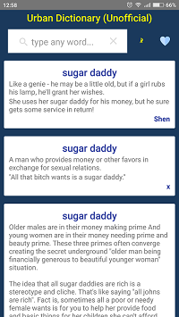

# Urban Dictionary (Unofficial)
Unofficial client for Urban Dictionary.

### Now it's removed from play market (by Google), the actual version is available by reference: [here](https://github.com/batulovandrey/UrbanSlang)

Find definitions that you like and save it to the list of favorites.

## Libraries used
| Name            | Description                                                 |  
| ----            | ------------  
| [Retrofit](http://square.github.io/retrofit/) |	A type-safe REST client for Android which intelligently maps an API into a client interface using annotations.
| [Guava](https://github.com/google/guava) | For clean code
| [Realm](https://realm.io/) | Realm is a mobile database that runs directly inside phones, tablets or wearables.
| [Dagger 2](https://github.com/google/dagger/) | A fast dependency injector for managing objects.
| [GSON](https://github.com/google/gson) | Library to parse data in JSON format.
| [Butterknife](http://jakewharton.github.io/butterknife/) | Using Java annotations, makes Android development better by simplifying common tasks.
